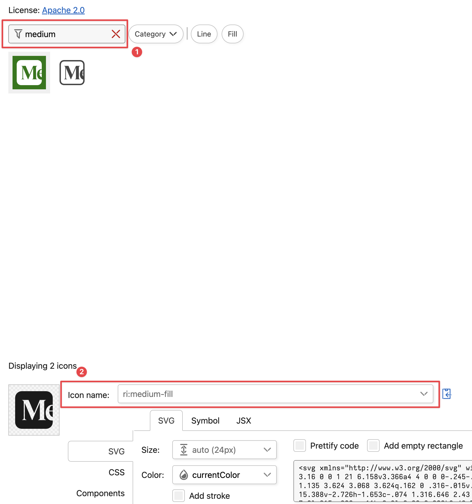

# Getting Started with Astro

Astro looks for `.astro` or `.md` files in the `src/pages/` directory. Each page is exposed as a route based on its file name.

Any static assets, like images, can be placed in the `public/` directory.

> **Note:** You must have [pnpm](https://pnpm.io/installation) installed globally to use the commands below.

## 🧞 Commands

All commands are run from the root of the project, from a terminal:

| Command                | Action                                           |
| :--------------------- | :----------------------------------------------- |
| `pnpm install`         | Installs dependencies                            |
| `pnpm dev`             | Starts local dev server at `localhost:4321`      |
| `pnpm build`           | Build your production site to `./dist/`          |
| `pnpm preview`         | Preview your build locally, before deploying     |
| `pnpm astro ...`       | Run CLI commands like `astro add`, `astro check` |
| `pnpm astro -- --help` | Get help using the Astro CLI                     |

---

# 📖 Publishing New Articles

This guide explains how to add new posts and authors to our Blog.

## 📂 Project Structure

Inside `src/content` you’ll find two key folders:

```
src/content
├── authors/   ← Author information (JSON)
└── blog/      ← Blog posts (Markdown)
```

---

## 👤 Adding an Author

1. Navigate to **`src/content/authors`**.
2. Create a new JSON file named after the author, e.g. `lucas.json`.
3. Follow this structure:

```json
{
  "name": "Lucas Souza",
  "image": {
    "url": "https://avatars.githubusercontent.com/u/29847191?v=4",
    "alt": "Lucas Souza's avatar"
  },
  "jobDescription": "Web Developer",
  "socials": [
    {
      "title": "GitHub",
      "url": "https://github.com/LucasCodr",
      "icon": "ri:github-fill"
    },
    {
      "title": "LinkedIn",
      "url": "https://www.linkedin.com/in/lucas-souza-11547414a/",
      "icon": "ri:linkedin-box-fill"
    }
  ]
}
```

### 🔗 About `socials`

- **`title`** → Label of the social media platform.
- **`url`** → Link to the profile.
- **`icon`** → Name of the desired icon from [Iconify](https://icon-sets.iconify.design/ri/?keyword=Ri).
- If you need another social media icon, just search for it there and copy its name.



This structure ensures you only define author info once, instead of repeating it in every blog post.

---

## 📝 Creating a Blog Post

1. Navigate to **`src/content/blog`**.
2. Create a new Markdown file, e.g. `ai-in-programming.md`.
3. Add the frontmatter at the top of the file:

````md
---
title: "AI in Programming: Practical Tips for Developers"
description: "Learn how to boost coding productivity with AI tools. Practical tips for developers on using AI for debugging, documentation, and faster software development."
pubDate: 2025-08-18
image:
  url: https://images.unsplash.com/photo-1633596683562-4a47eb4983c5?q=80&w=2064&auto=format&fit=crop&ixlib=rb-4.1.0&ixid=M3wxMjA3fDB8MHxwaG90by1wYWdlfHx8fGVufDB8fHx8fA%3D%3D
  alt: AI in Programming Cover
tags: [AI, Productivity, Software Engineering, Startup]
author: "lucas" # Matches the JSON filename in /authors
---

## Introduction

Write the opening section of your blog post here.
You can use **Markdown** for formatting, add lists, images, code snippets, etc.

### Example Subheading

Some more content...

```js
// Example code block
console.log("Hello, world!");
```

### Another Subheading

Keep writing your content here.
````

---

## 📑 Blog Post Template

To make things easier, use this template when starting a new post:

```md
---
title: "Post Title Here"
description: "A short description of your post goes here."
pubDate: 2025-08-21
image:
  url: /images/blog/your-image.jpg
  alt: "Cover image alt text"
tags: [Tag1, Tag2, Tag3]
author: "author-id" # Matches the filename in /authors
---

## Introduction

Your content starts here...
```

---

## ✅ Checklist Before Publishing

- [ ] Created/updated the author in `/authors` if needed
- [ ] Added a new Markdown file in `/blog`
- [ ] Filled out the frontmatter properly (title, description, pubDate, image, tags, author)
- [ ] Added post content in Markdown
- [ ] Tested locally to confirm everything looks good

---
