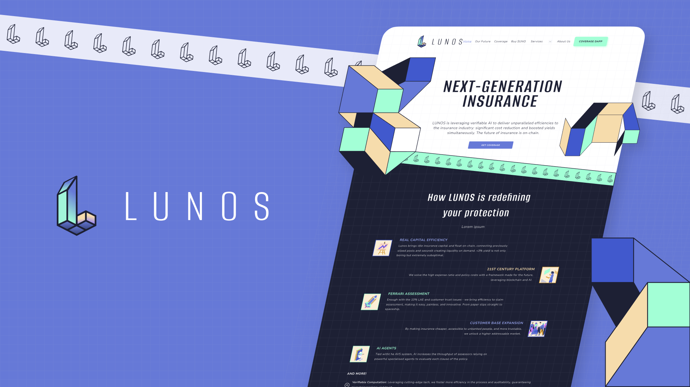
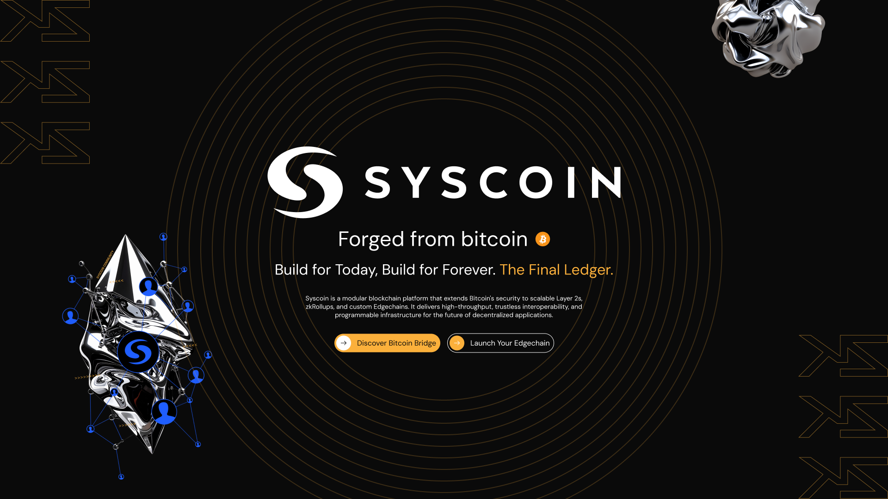
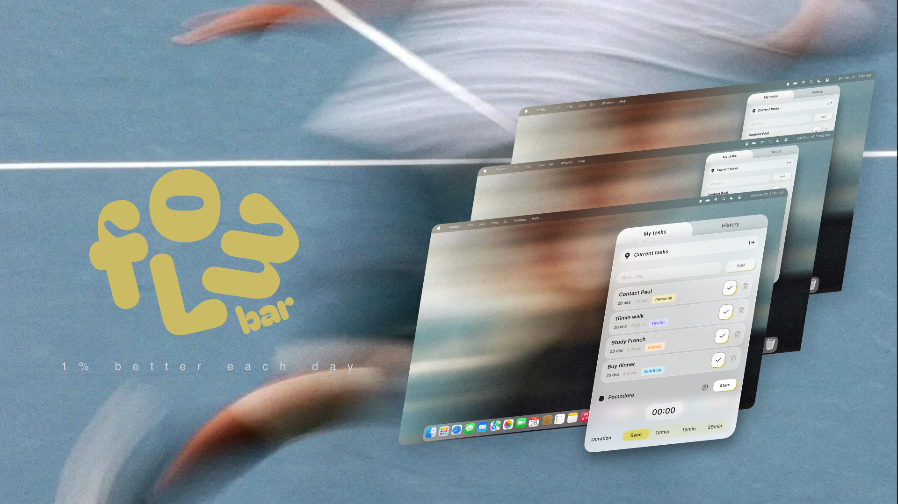
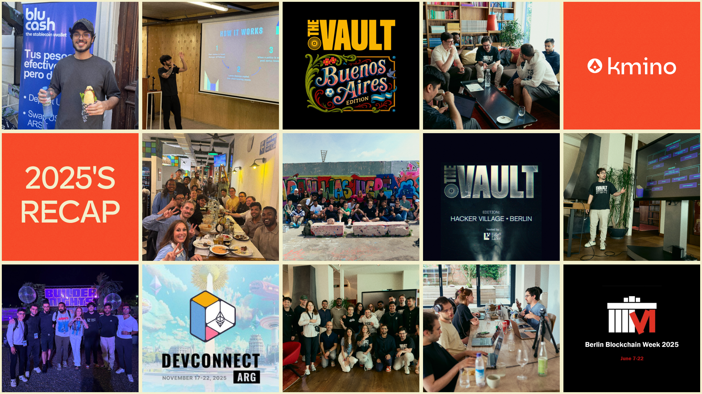

# Looking Back at Our 2025

Kmino was born in 2025. My other founders and I come from a tech background, and have worked on both other software agencies as well as big corporate, and we've seen the good and bad from both worlds. 

When we first embarked on this journey of starting our own company, the vision was that we could deliver a better experience for everyone involved: developers could have quality work-life-balance with structured processes in place, targeted use of the best tooling available, and projects that excites them to come to work; and our clients could have peace of mind that they had capable engineers taking care of the tech part while they could focus on other aspects of the business where their expertise lies, without the HR hassle or paying exorbitant prices for outsourcing.

Our goal was to do things differently. To "build better paths", as our slogan says.

2025 blinked away. I recall planning for the year like it was yesterday, and now I'm reflecting on what already passed. There were stressful moments, hard deliverables, outside-of-tech challenges, but overall, 2025 was a great year.

We were able to keep pushing towards our goal, for both existing clients as well as new partnerships, and today it's time to look back at what was achieved, and prepare for 2026.

## Current Partnerships

On your day-to-day execution, it's easy to lose perspective on how much you are actually delivering. As an old mentor said to me once, sometimes we need to 'turn the telescope around', and for this piece, I did just that. I went back to our development boards and looked at how much our teams delivered for some of our current tech partners.

SuperDapp is a great example. A Web3 native superapp, SuperDapp is a complex and layered application, born out of a legacy app we have a small squad allocated to. In 2025, we delivered great features, yes: 

- An AI Agent framework, with extensive documentation and API support, so any developer could deploy their own AI Agent on SuperDapp's chat interface, and monetize as they want
- An entire overhaul of the application, bringing Dark Mode to a formerly rigid, legacy frontend

But maintaining an application of this size, you also need to plan accordingly for bug fixing and overall improvements on performance, security, usability, and maintanibility. And this took quite the time out of our team. Hundreds and hundreds of bug fixes were delivered, putting the app in a better place for all its users.

Another great example is Lunos. A Web3 insurance protocol, the project had its technological challenges, but Kmino also supported them on product advisory, raises, and business guidance. 

In 2025, the former UNO Re app went through a complete rebranding and repositioning. Fast iterations, finding product-market fit, and discussing with potential investors: Kmino helped them through it all.

And, as we can't escape our roots, we also explored different new technology frameworks to achieve the new product vision, such as Eigen Cloud's solutions for verifiable computation, and how it could be applied for traditional insurance. 

Some features and deliverables are planned for weeks, months, or quarters. Others are sometimes year-long planning and execution. For Syscoin, our team's main work will launch only in 2026, but they earned a special mention in this post.

We worked together with the Syscoin Foundation to deliver their upcoming Layer-2 solution, zkSys, based on zero-knowledge proofs, and inheriting the Bitcoin-security from their L1.

We also supported a complete refactor of Pali Wallet, the main extension wallet from their ecosystem, enabling users to interact with both UTXO and EVM-based chains, assets, and dApps. The refactor improved layout, usability, security, and performance, and we're really excited to hear the feedback from the users once the application goes live!

Finally, to solve an old business problem, we took the challenge of developing a new bridge from scratch, based on Hyperlane's architecture, enabling users to join and leave the upcoming zkSys ecosystem with ease, while we also returned the control of this vital piece of infrastructure to our partner, rather than leaving this at 3rd-party hands.

## Looking Inwards

Looking at our own team, we were able to plant some seeds of what we want Kmino to become. The first of them was the launch of our internal development project, "Zero to Hero", where we hire some out-of-college junior developers, even without previous work experience, but with fire in their eyes and hungry for more, willing to learn with our experienced senior developers in a real-world setting, not only video lessons.

With the duration of 3 months, the developer has to go over some basic onboarding tasks, read a few of our internal book recommendations, and complete a scope of work for one of our clients, previously defined in a common agreement. We'll teach them the basics, give them access to AI-powered tools and show them the ropes, and mentor them until they can run with their own legs.

The first application was a success, and now the Kmino team can count on another developer. We're looking forward to onboarding new talent engineers next year :)

## FlowBar and new Products

Something new that we wanted to explore with Kmino was to bring new ideas to life, mini internal projects, if you will.

With a pool of talented people in-house, powerful dev tools, and extensive know-how, it's a no-brainer to solve simple problems with the help of tech.

And the first (almost finalized) product is FlowBar, which is a simple, yet beautiful, minimalist, and useful task tracker for macOS. Integrating with macOS shortcuts, apart from tracking tasks with labeling and whatnot, it also sets Do-Not-Disturb focus when a custom-set Pomodoro timer is activated. We expect to open beta access early in 2026, so stay tuned for that!

Personally, the most exciting part was to see the entire team engaging in its development on their free time, testing the app, giving feedback, and collaborating on features. It just solidifies the culture that we want to create of curiosity, ownership, and knowledge-sharing. I'm eager to see what this talented team comes up with next!

## Conferences, Meetups, and Events

More than in front of our computers, we also spend a lot of time in the wild. Conferences, Meetups and IRL events kept us busy during 2025.

During the Berlin Blockchain Week 2025, back in June, we attended A LOT of events, connected with other builders, heard what they were working on, presented Kmino, and established a lot of new contacts. It was really nice to see how vibrant the European ecosystem was during that time.

One of the events we participated in during that period was Eigen's hackerhouse, where we worked together with other builders using Eigen's tools to solve real-world problems. That also got us an invite to participate in another Eigen's hackerhouse in Argentina, during the week prior to DevConnect 2025, in November. 

Somehow, their team was able to elevate the first experience, and the vibes in Buenos Aires were immaculate; all eyes were on DevConnect, so the city was full of founders, builders, and decision makers.

And, of course, apart from the main conferences and events, there were a lot of side events our team attended, bringing more perspective, new connections, and new business opportunities.

## New Partnerships and Connections

In all these events, IRL and virtual, we made a lot of connections. From the US to Europe to LATAM to Asia to Australia, we talked with people everywhere. Heard their stories, shared our own, strengthened existing bonds, and created new ones.

Part of what Kmino was created to do is to help bring new ideas to life, and these ideas all come from people everywhere. It was extremely valuable to connect with new folks from the most diverse backgrounds and discuss different markets, technologies, and ideas. 

From our business perspective, some of them already bear some fruit. We're working on projects on Syscoin, SUI, and Ethereum, and even new MVPs on markets not in our sight before, such as Prediction Markets, and other goodies we hope to share more in the coming months!

## Looking Ahead, 2026

I'm glad I sat down to write this piece. It's easy to lose perspective on how much was done when you're always on the move. 

2025 was a great year. A difficult one, for sure: no alt-season on crypto, cautious market on tradFi, AI boom and hype and (sometimes) disappointment, but overall we achieve a lot of what was planned.

Now it's time to rest, recollect, and prepare for 2026. A new blank sheet, ready to be filled with plans, execution, and new accomplishments. 

As usual, don't forget to follow us on [LinkedIn](https://www.linkedin.com/company/kminotech/), and happy holidays!
